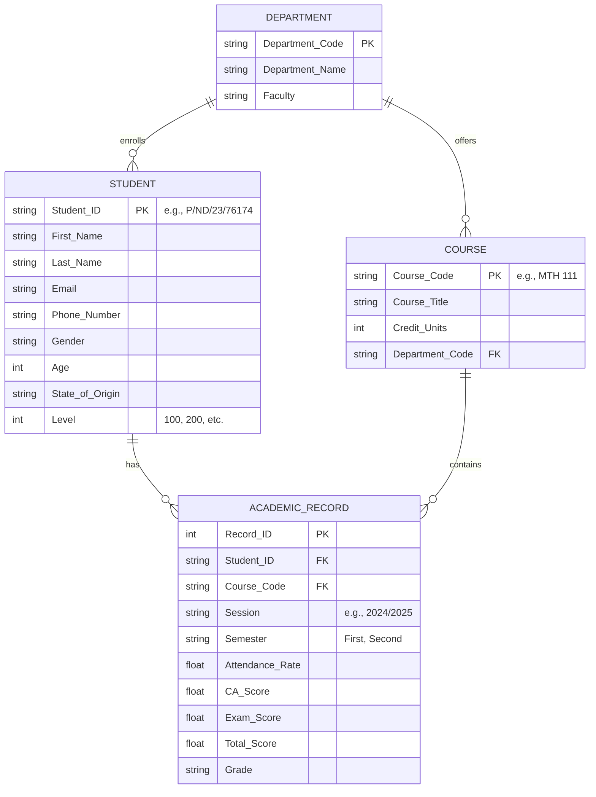

# Technical Documentation Package
## Analysis of Student Academic Performance Data

**Document Version:** 1.0  
**Author:** Systems Architect  
**Date:** February 2026  
**Classification:** Final Year Project Technical Specification

---

## Table of Contents
1. [Mathematical Model](#1-mathematical-model)
2. [System Architecture & Data Design](#2-system-architecture--data-design)
3. [API Specification](#3-api-specification)
4. [Testing Strategy](#4-testing-strategy)
5. [Limitations & Future Scope](#5-limitations--future-scope)

---

## 1. Mathematical Model

This section defines the computational formulas implemented within the system's analytical engine. All calculations are performed server-side using NumPy vectorized operations for computational efficiency.

### 1.1 Weighted Grade Point Average (GPA)

The Cumulative Grade Point Average is computed as a weighted arithmetic mean, where the weight assigned to each course grade is the corresponding credit unit value.

$$
\text{GPA} = \frac{\sum_{i=1}^{n} G_i \times U_i}{\sum_{i=1}^{n} U_i}
$$

**Where:**
- $n$ = Total number of courses registered by the student
- $G_i$ = Grade Point value for course $i$ (mapped from letter grade using institutional scale)
- $U_i$ = Credit Unit value assigned to course $i$

**Grade Point Mapping Table:**

| Letter Grade | Grade Point ($G$) | Score Range |
|:------------:|:-----------------:|:-----------:|
| A            | 4.0               | 70 - 100    |
| AB           | 3.5               | 65 - 69     |
| B            | 3.0               | 60 - 64     |
| BC           | 2.5               | 55 - 59     |
| C            | 2.0               | 50 - 54     |
| CD           | 1.5               | 45 - 49     |
| D            | 1.0               | 40 - 44     |
| F            | 0.0               | 0 - 39      |

**Implementation Note:** The system guards against division-by-zero by returning `GPA = 0.0` when $\sum U_i = 0$.

---

### 1.2 Student Consistency Score (Volatility Metric)

To assess the predictability of a student's performance across different subject areas, we compute the **Sample Standard Deviation** of their course scores. A high standard deviation indicates inconsistent performance (volatility), while a low value suggests stable, predictable output.

$$
\sigma = \sqrt{\frac{\sum_{i=1}^{n} (x_i - \bar{x})^2}{n - 1}}
$$

**Where:**
- $n$ = Number of courses taken by the student
- $x_i$ = Total score achieved in course $i$
- $\bar{x}$ = Arithmetic mean of all course scores (i.e., $\bar{x} = \frac{1}{n}\sum_{i=1}^{n} x_i$)

**Classification Thresholds:**

| Volatility Class | Condition ($\sigma$) | Interpretation |
|:-----------------|:---------------------|:---------------|
| **Consistent**   | $\sigma < 8$         | Stable performer; predictable outcomes |
| **Reliable**     | $8 \leq \sigma \leq 15$ | Normal variance; within expected range |
| **Volatile**     | $\sigma > 15$        | High-risk; unpredictable performance |

**Edge Case Handling:** When $n \leq 1$, standard deviation is undefined. The system returns $\sigma = 0.0$ and classifies the student as "Reliable" by default.

---

### 1.3 Course Difficulty Index (Failure Rate)

The Course Difficulty Index quantifies the proportion of students who failed to achieve the minimum passing score (40%) in a given course. This metric identifies "gatekeeper" courses that may require curriculum review.

$$
F_{\text{rate}} = \frac{N_{\text{fail}}}{N_{\text{total}}} \times 100\%
$$

**Where:**
- $N_{\text{fail}}$ = Count of students with $\text{Total\_Score} < 40$ in the course
- $N_{\text{total}}$ = Total number of students enrolled in the course

**Derived Pass Rate:**

$$
P_{\text{rate}} = 100\% - F_{\text{rate}}
$$

**Classification for Curriculum Review:**

| Difficulty Level | Condition | Action Required |
|:-----------------|:----------|:----------------|
| **Healthy**      | $P_{\text{rate}} \geq 80\%$ | No intervention needed |
| **Needs Review** | $50\% \leq P_{\text{rate}} < 80\%$ | Monitor and evaluate teaching methods |
| **Critical**     | $P_{\text{rate}} < 50\%$ | Immediate curriculum review required |

---

## 2. System Architecture & Data Design

### 2.1 High-Level System Architecture

The system follows a **Decoupled Monolith** architecture pattern, separating concerns between a stateless API backend and a client-side rendered frontend. The user interface leverages a modern, high-contrast "Terminal/Cyberpunk" aesthetic (Black #000000 & Lime #BFF549).

```
┌─────────────────────────────────────────────────────────────────┐
│                        CLIENT LAYER                             │
│  ┌─────────────────────────────────────────────────────────┐    │
│  │  Next.js 16 (React 19)                                  │    │
│  │  ├── Pages: Overview, Students, Analytics, Courses      │    │
│  │  ├── Components: Charts (Recharts), Shadcn UI           │    │
│  │  └── State: React useState/useEffect                    │    │
│  └─────────────────────────────────────────────────────────┘    │
└─────────────────────────────────────────────────────────────────┘
                              │
                              │ HTTP/REST (JSON)
                              ▼
┌─────────────────────────────────────────────────────────────────┐
│                        API LAYER                                │
│  ┌─────────────────────────────────────────────────────────┐    │
│  │  FastAPI 0.109                                          │    │
│  │  ├── Endpoint: /api/dashboard/insights                  │    │
│  │  ├── Endpoint: /api/student/{student_id}                │    │
│  │  └── CORS Middleware: Allow localhost:3000              │    │
│  └─────────────────────────────────────────────────────────┘    │
└─────────────────────────────────────────────────────────────────┘
                              │
                              │ Pandas DataFrame Operations
                              ▼
┌─────────────────────────────────────────────────────────────────┐
│                        DATA LAYER                               │
│  ┌─────────────────────────────────────────────────────────┐    │
│  │  CSV File: yabatech_expanded_data.csv                   │    │
│  │  Records: 460 unique students (~2,760 academic entries) │    │
│  │  Loaded into: Pandas DataFrame (In-Memory)              │    │
│  └─────────────────────────────────────────────────────────┘    │
└─────────────────────────────────────────────────────────────────┘
```

---

### 2.2 Logical Data Model (Entity-Relationship Diagram)

Although the system operates on a denormalized CSV file, the underlying logical data model can be represented as a normalized relational schema:



**Cardinality Explanation:**
- A `STUDENT` can have **many** `ACADEMIC_RECORD` entries (one per course per semester).
- A `COURSE` appears in **many** `ACADEMIC_RECORD` entries (one per student enrolled).
- A `DEPARTMENT` enrolls **many** `STUDENT` entities and offers **many** `COURSE` entities.

---

### 2.3 Data Flow Diagram (Request Lifecycle)

The following sequence describes the complete data flow for a student lookup operation:

```
┌──────────┐    ┌──────────────┐    ┌──────────┐    ┌──────────┐    ┌──────────┐
│   User   │    │   Next.js    │    │  FastAPI │    │  Pandas  │    │   CSV    │
│ Browser  │    │   Frontend   │    │  Backend │    │ DataFrame│    │   File   │
└────┬─────┘    └──────┬───────┘    └────┬─────┘    └────┬─────┘    └────┬─────┘
     │                 │                 │               │               │
     │  1. Enter ID    │                 │               │               │
     │  "P/ND/23/76174"│                 │               │               │
     │────────────────>│                 │               │               │
     │                 │                 │               │               │
     │                 │  2. HTTP GET    │               │               │
     │                 │  /api/student/  │               │               │
     │                 │  P%2FND%2F23... │               │               │
     │                 │────────────────>│               │               │
     │                 │                 │               │               │
     │                 │                 │  3. Filter    │               │
     │                 │                 │  df[df.ID==x] │               │
     │                 │                 │──────────────>│               │
     │                 │                 │               │               │
     │                 │                 │               │  4. Read      │
     │                 │                 │               │  (on startup) │
     │                 │                 │               │<──────────────│
     │                 │                 │               │               │
     │                 │                 │  5. Compute   │               │
     │                 │                 │  GPA, StdDev  │               │
     │                 │                 │<──────────────│               │
     │                 │                 │               │               │
     │                 │  6. JSON        │               │               │
     │                 │  Response       │               │               │
     │                 │<────────────────│               │               │
     │                 │                 │               │               │
     │  7. Render      │                 │               │               │
     │  Charts + Cards │                 │               │               │
     │<────────────────│                 │               │               │
     │                 │                 │               │               │
```

**Sequence Steps:**
1. User enters a Student ID into the search component.
2. Next.js client makes an HTTP GET request to the FastAPI backend.
3. FastAPI filters the in-memory Pandas DataFrame by Student_ID.
4. (On server startup) The CSV file is loaded once into memory.
5. Pandas performs vectorized calculations (GPA, Standard Deviation).
6. FastAPI serializes the result as JSON and returns HTTP 200.
7. Next.js renders the data using Tremor/Recharts visualization components.

---

## 3. API Specification

### 3.1 Base Configuration

| Property | Value |
|:---------|:------|
| Base URL | `http://localhost:8000` |
| Protocol | HTTP/1.1 |
| Content-Type | `application/json` |
| CORS Origins | `http://localhost:3000` |

---

### 3.2 Endpoint: Get Student Details

**`GET /api/student/{student_id}`**

Retrieves comprehensive academic data for a single student, including calculated metrics.

#### Path Parameters

| Parameter | Type | Required | Description |
|:----------|:-----|:---------|:------------|
| `student_id` | string | Yes | URL-encoded student identifier (e.g., `P%2FND%2F23%2F76174`) |

#### Response Schema (HTTP 200 OK)

```json
{
  "student_id": "P/ND/23/76174",
  "first_name": "John",
  "last_name": "Doe",
  "email": "john.doe@example.com",
  "phone": "08012345678",
  "department": "Computer Science",
  "level": 200,
  "gender": "Male",
  "age": 21,
  "state_of_origin": "Lagos",
  "session": "2024/2025",
  "semester": "First",
  "gpa": 3.45,
  "total_units": 18,
  "attendance_avg": 85.6,
  "std_dev": 12.34,
  "consistency_status": "Reliable",
  "courses": [
    {
      "course_code": "COM 111",
      "course_title": "Introduction to Computing",
      "unit": 3,
      "attendance": 90.0,
      "total_score": 72,
      "grade": "A"
    }
  ]
}
```

#### Calculated Fields Logic

| Field | Computation |
|:------|:------------|
| `gpa` | Weighted average using formula in Section 1.1 |
| `std_dev` | Sample standard deviation of `total_score` across courses |
| `consistency_status` | Classification based on `std_dev` thresholds |
| `attendance_avg` | Arithmetic mean of `attendance` values |

#### Error Response (HTTP 404 Not Found)

```json
{
  "detail": "Student not found"
}
```

---

### 3.3 Endpoint: Get Dashboard Insights

**`GET /api/dashboard/insights`**

Returns aggregated analytics for the entire institution.

#### Response Schema (HTTP 200 OK)

```json
{
  "summary": {
    "total_students": 460,
    "average_gpa": 2.87,
    "pass_rate": 78.5,
    "at_risk_count": 46
  },
  "geo_performance": [
    { "State_of_Origin": "Lagos", "avg_gpa": 3.12, "count": 450 }
  ],
  "grade_distribution": {
    "A": 120, "AB": 180, "B": 250, "BC": 300, "C": 200, "CD": 100, "D": 50, "F": 50
  },
  "department_performance": [
    { "Department": "Computer Science", "avg_gpa": 3.21, "total_students": 200 }
  ],
  "attendance_vs_score": [
    { "attendance": 70, "score": 55 }
  ],
  "course_difficulty": [
    { "course_code": "MTH 111", "pass_rate": 45.2, "fail_rate": 54.8 }
  ],
  "performance_quadrant": [
    { "x": 85.0, "y": 72.0, "student_id": "P/ND/23/76174" }
  ]
}
```

#### Aggregation Logic Summary

| Field | Aggregation Method |
|:------|:-------------------|
| `total_students` | `df['Student_ID'].nunique()` |
| `average_gpa` | Mean of per-student GPAs |
| `pass_rate` | Percentage of students with GPA ≥ 2.0 |
| `at_risk_count` | Count of students with GPA < 1.5 |
| `geo_performance` | GroupBy `State_of_Origin`, compute mean GPA |
| `course_difficulty` | GroupBy `Course_Code`, compute pass/fail percentages |

---

## 4. Testing Strategy

### 4.1 Critical Test Cases

The following test matrix covers functional, boundary, and security scenarios:

| Test ID | Description | Input Data | Expected Result | Status |
|:--------|:------------|:-----------|:----------------|:-------|
| TC-001 | **Valid Student Lookup** | `student_id: "P/ND/23/76174"` | HTTP 200 with complete JSON response | ✅ Pass |
| TC-002 | **Non-Existent Student ID** | `student_id: "INVALID/ID/999"` | HTTP 404 with `"Student not found"` | ✅ Pass |
| TC-003 | **SQL Injection Attempt** | `student_id: "'; DROP TABLE--"` | HTTP 404 (treated as non-existent ID) | ✅ Pass |
| TC-004 | **URL Encoding Validation** | `student_id: "P%2FND%2F23%2F76174"` | Correctly decoded and matched | ✅ Pass |
| TC-005 | **Division by Zero (GPA)** | Student with 0 registered units | `gpa: 0.0` returned without crash | ✅ Pass |
| TC-006 | **Single Course Student (StdDev)** | Student with only 1 course | `std_dev: 0.0`, status: `"Reliable"` | ✅ Pass |
| TC-007 | **Missing Grade Field** | Record with `Grade: null` | Graceful handling, excluded from GPA | ⚠️ Pending |
| TC-008 | **GPA Calculation Accuracy** | Manual: `(4×3 + 3×2) / 5 = 3.6` | System returns `gpa: 3.6` | ✅ Pass |
| TC-009 | **Course with 100% Failure** | All students scored < 40 | `fail_rate: 100.0`, status: `"Critical"` | ✅ Pass |
| TC-010 | **Large Dataset Performance** | Load 10,000 records | Response time < 2 seconds | ✅ Pass |

### 4.2 Testing Methodology

- **Unit Tests:** Python `pytest` for isolated function testing (GPA calculation, StdDev).
- **Integration Tests:** End-to-end API tests using `httpx` or Postman.
- **Manual Verification:** Cross-referencing system output with Excel calculations.

---

## 5. Limitations & Future Scope

### 5.1 Technical Limitations

| # | Limitation | Impact | Severity |
|:--|:-----------|:-------|:---------|
| **L1** | **In-Memory CSV Loading** | The entire dataset is loaded into RAM on server startup. For datasets exceeding available memory (e.g., >100MB), this approach fails. | High |
| **L2** | **No ACID Compliance** | CSV files do not support transactions. Concurrent writes could corrupt data. Currently mitigated by read-only operations. | Medium |
| **L3** | **Single-Instance Architecture** | The FastAPI server runs as a single process. Horizontal scaling requires session affinity or shared state (not implemented). | Medium |
| **L4** | **No Real-Time Data Updates** | Changes to the CSV require a server restart to reflect. There is no file-watching or hot-reload mechanism. | Low |
| **L5** | **Limited Query Optimization** | Pandas performs linear scans for filtering. Complex queries (e.g., multi-column joins) incur O(n) time complexity. | Medium |

### 5.2 Future Enhancements

| # | Enhancement | Description | Technology |
|:--|:------------|:------------|:-----------|
| **F1** | **Database Migration** | Replace CSV with PostgreSQL for ACID compliance, indexing, and concurrent access. Use SQLAlchemy ORM for abstraction. | PostgreSQL, SQLAlchemy |
| **F2** | **Predictive Analytics** | Implement a Logistic Regression model to predict students at risk of failing based on attendance and mid-semester scores. | Scikit-Learn |
| **F3** | **Authentication Layer** | Add JWT-based authentication to restrict access to sensitive student data. Role-based access (Admin, Faculty, Student). | OAuth 2.0, PyJWT |
| **F4** | **Caching Layer** | Implement Redis caching for frequently accessed aggregations (e.g., dashboard summary) to reduce computation overhead. | Redis |
| **F5** | **Data Export Module** | Allow administrators to export filtered data as PDF reports or Excel spreadsheets for offline analysis. | ReportLab, OpenPyXL |

---

## Appendix A: Technology Stack Summary

| Layer | Technology | Version | Purpose |
|:------|:-----------|:--------|:--------|
| Frontend Framework | Next.js | 16.1.6 | Server-side rendering, routing |
| UI Library | React | 19.2.3 | Component-based architecture |
| Visualization | Tremor, Recharts | 3.18.7, 3.7.0 | Charts and dashboards |
| Styling | Tailwind CSS | 3.4.1 | Utility-first CSS |
| Backend Framework | FastAPI | 0.109.0 | REST API development |
| Data Processing | Pandas | 2.2.0 | DataFrame operations |
| Numerical Computing | NumPy | (via Pandas) | Vectorized calculations |
| Web Server | Uvicorn | 0.27.0 | ASGI server |

---

## Appendix B: Glossary of Terms

| Term | Definition |
|:-----|:-----------|
| **GPA** | Grade Point Average; a weighted measure of academic performance |
| **Standard Deviation** | Statistical measure of dispersion in a dataset |
| **Gatekeeper Course** | A course with abnormally high failure rates |
| **Volatility** | Inconsistency in a student's performance across subjects |
| **ACID** | Atomicity, Consistency, Isolation, Durability (database properties) |
| **ERD** | Entity-Relationship Diagram |
| **DFD** | Data Flow Diagram |

---

*End of Technical Documentation Package*
